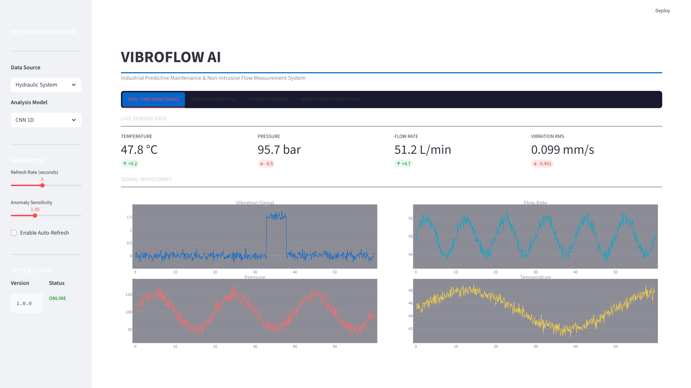
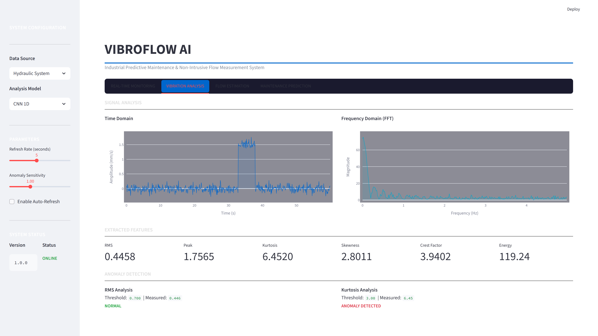
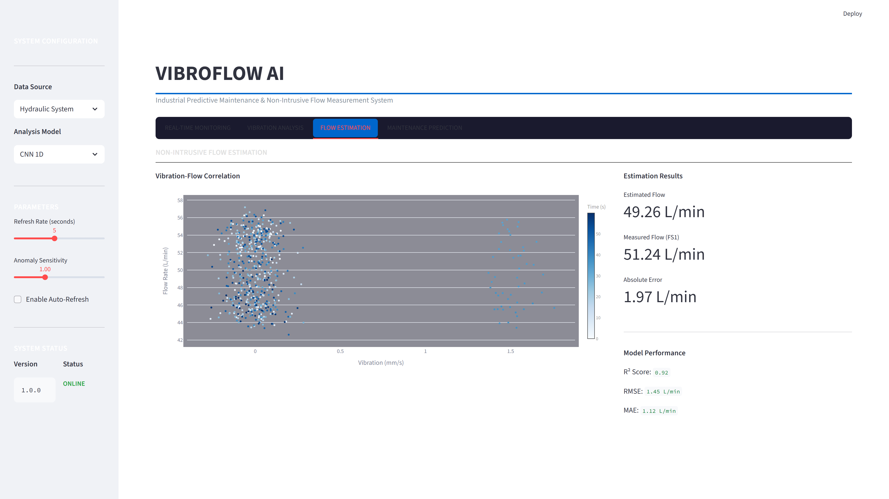
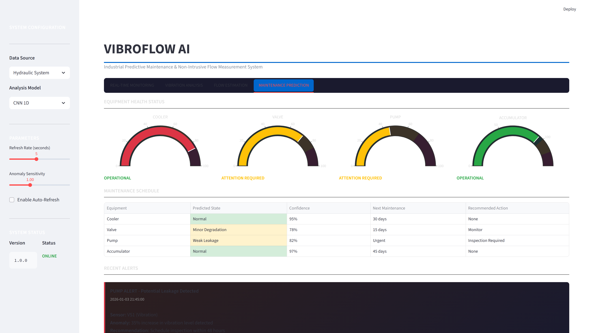

<div align="center">

#  VibroFlow AI

###  Predictive Maintenance & Non-Intrusive Flow Measurement Using AI-Powered Vibration Analysis

[](https://www.python.org/)
[](https://pytorch.org/)
[](https://streamlit.io/)
[](https://scikit-learn.org/)
[](LICENSE)

<p align="center">
  <em>Transform vibration signals into actionable insights with state-of-the-art machine learning and deep learning models</em>
</p>

[Features](#-key-features) •
[Installation](#-quick-start) •
[Usage](#-usage) •
[Models](#-models) •
[Dashboard](#-interactive-dashboard) •
[Documentation](#-documentation)

---


</div>

---

##  Overview

**VibroFlow AI** is an intelligent system that combines **predictive maintenance** and **non-intrusive flow measurement** through advanced analysis of **vibration signatures** using cutting-edge **Artificial Intelligence** techniques.

The system processes multi-sensor data from hydraulic systems and rotating machinery to detect anomalies, predict equipment failures, and estimate flow rates without invasive instrumentation.

###  Core Objectives

| Objective | Description |
|-----------|-------------|
|  **Fault Detection** | Classify bearing defects and equipment anomalies from vibration patterns |
|  **Condition Monitoring** | Real-time assessment of hydraulic components (cooler, valve, pump, accumulator) |
|  **Flow Estimation** | Non-intrusive flow rate prediction through vibration-flow correlation |
|  **Early Warning** | Predictive alerts before critical failures occur |

---

##  Key Features

<table>
<tr>
<td width="50%">

###  Machine Learning
- Support Vector Machines (SVM)
- Random Forest & Gradient Boosting
- XGBoost & K-Nearest Neighbors
- Ensemble methods with hyperparameter tuning

</td>
<td width="50%">

###  Deep Learning
- 1D Convolutional Neural Networks (CNN)
- Bidirectional LSTM Networks
- Hybrid CNN-LSTM Architectures
- Transfer learning capabilities

</td>
</tr>
<tr>
<td width="50%">

###  Signal Processing
- Time-domain feature extraction
- FFT & spectral analysis
- Wavelet decomposition (PyWavelets)
- Statistical & entropy-based features

</td>
<td width="50%">

###  Interactive Dashboard
- Real-time monitoring visualization
- Multi-sensor data display
- Prediction confidence scores
- Equipment health indicators

</td>
</tr>
</table>

---

##  Datasets

### Dataset 0: Hydraulic System Condition Monitoring
> Source: [ZeMA gGmbH](https://doi.org/10.1109/I2MTC.2015.7151267) | 2,205 measurement cycles

| Sensor | Description | Sampling Rate | Samples/Cycle |
|--------|-------------|---------------|---------------|
| **PS1-PS6** | Pressure sensors | 100 Hz | 6,000 |
| **TS1-TS4** | Temperature sensors | 1 Hz | 60 |
| **VS1** | Vibration sensor | 1 Hz | 60 |
| **FS1-FS2** | Flow sensors | 10 Hz | 600 |
| **EPS1** | Motor power | 100 Hz | 6,000 |
| **CE, CP, SE** | Efficiency metrics | 1 Hz | 60 |

**Target Conditions:**
-  Cooler condition: `3%` → `100%`
-  Valve condition: `73%` → `100%`
-  Pump leakage: `0` (none) → `2` (severe)
-  Accumulator pressure: `90` → `130` bar

### Dataset 1: CWRU Bearing Fault Database
> Source: [Case Western Reserve University](https://engineering.case.edu/bearingdatacenter) | 48kHz sampling

| Fault Type | Description | Fault Diameters |
|------------|-------------|-----------------|
| **Normal** | Healthy bearing operation | - |
| **Ball (B)** | Rolling element defects | 0.007", 0.014", 0.021" |
| **Inner Race (IR)** | Inner race defects | 0.007", 0.014", 0.021" |
| **Outer Race (OR)** | Outer race defects | 0.007", 0.014", 0.021" |

---

##  Project Architecture

```
VibroFlow AI/
│
├── 📂 app/
│   └── dashboard.py           #  Streamlit interactive dashboard
│
├── 📂 src/
│   ├── 📂 data/
│   │   ├── loader.py          # Data loading utilities
│   │   ├── preprocessor.py    # Signal preprocessing
│   │   └── features.py        # Feature extraction (Time/Freq/Wavelet)
│   │
│   ├── 📂 models/
│   │   ├── baseline.py        # Classical ML models
│   │   └── deep_learning.py   # CNN, LSTM, Hybrid networks
│   │
│   ├── 📂 flow/
│   │   └── estimator.py       # Non-intrusive flow estimation
│   │
│   └── 📂 utils/              # Helper functions
│
├── 📂 dataset0/               # Hydraulic system data
├── 📂 dataset1/               # CWRU bearing data
├── 📂 models/                 # Saved trained models (.pth, .joblib)
├── 📂 notebooks/              # Jupyter analysis notebooks
│
├── requirements.txt           # Python dependencies
└── README.md                  # This file
```

---

##  Quick Start

### Prerequisites
- Python 3.10 or higher
- CUDA-compatible GPU (optional, for deep learning acceleration)

### Installation

```bash
# 1️⃣ Clone the repository
git clone https://github.com/achrafS133/vibroflow-ai.git
cd "VibroFlow AI"

# 2️⃣ Create virtual environment
python -m venv venv

# 3️⃣ Activate environment
# Windows
venv\Scripts\activate
# Linux/macOS
source venv/bin/activate

# 4️⃣ Install dependencies
pip install -r requirements.txt
```

### Verify Installation

```python
# Test imports
from src.data.loader import HydraulicDataLoader, CWRUBearingDataLoader
from src.models.deep_learning import CNN1D
from src.flow.estimator import FlowEstimator

print(" VibroFlow AI installed successfully!")
```

---

##  Usage

###  Launch Interactive Dashboard

```bash
streamlit run app/dashboard.py
```

Access the dashboard at `http://localhost:8501`

---

###  Loading Datasets

```python
from src.data.loader import HydraulicDataLoader, CWRUBearingDataLoader

# ═══════════════════════════════════════════════════════
#  Hydraulic System Dataset
# ═══════════════════════════════════════════════════════
hydraulic_loader = HydraulicDataLoader("dataset0")

# Load sensor data
pressure_data = hydraulic_loader.load_sensor("PS1")     # Shape: (2205, 6000)
vibration_data = hydraulic_loader.load_sensor("VS1")    # Shape: (2205, 60)
flow_data = hydraulic_loader.load_sensor("FS1")         # Shape: (2205, 600)

# Load target conditions
targets = hydraulic_loader.load_targets()
# Returns: cooler, valve, pump_leakage, accumulator, stable_flag

# ═══════════════════════════════════════════════════════
#  CWRU Bearing Dataset
# ═══════════════════════════════════════════════════════
cwru_loader = CWRUBearingDataLoader("dataset1")

# Load preprocessed features
features_df = cwru_loader.load_features_csv()

# Load raw signals for deep learning
X, y = cwru_loader.load_cnn_data()  # Shape: (n_samples, 2048)
```

---

###  Feature Extraction

```python
from src.data.features import TimeFeatureExtractor, FrequencyFeatureExtractor

# ═══════════════════════════════════════════════════════
# ⏱ Time-Domain Features
# ═══════════════════════════════════════════════════════
time_extractor = TimeFeatureExtractor()

# Single signal
features = time_extractor.extract_all(signal)
# Returns: mean, std, rms, max, min, peak_to_peak,
#          skewness, kurtosis, crest_factor, shape_factor,
#          impulse_factor, margin_factor, energy, entropy

# Batch processing
feature_matrix = time_extractor.extract_batch(signals)  # (n_samples, 14 features)

# ═══════════════════════════════════════════════════════
#  Frequency-Domain Features
# ═══════════════════════════════════════════════════════
freq_extractor = FrequencyFeatureExtractor(sampling_freq=48000)

spectral_features = freq_extractor.extract_all(signal)
# Returns: spectral_centroid, spectral_bandwidth, spectral_rolloff,
#          spectral_flatness, spectral_entropy, spectral_peak_freq,
#          band_power_low, band_power_mid, band_power_high, total_power
```

---

###  Machine Learning Classification

```python
from src.models.baseline import BaselineClassifier, ModelComparison
from sklearn.model_selection import train_test_split

# Prepare data
X_train, X_test, y_train, y_test = train_test_split(X, y, test_size=0.2)

# ═══════════════════════════════════════════════════════
#  Train Random Forest Classifier
# ═══════════════════════════════════════════════════════
rf_classifier = BaselineClassifier(model_type='rf')
rf_classifier.fit(X_train, y_train)

# Evaluate
metrics = rf_classifier.evaluate(X_test, y_test)
print(f"Accuracy: {metrics['accuracy']:.4f}")
print(f"F1-Score: {metrics['f1_score']:.4f}")

# ═══════════════════════════════════════════════════════
#  Compare Multiple Models
# ═══════════════════════════════════════════════════════
comparison = ModelComparison()
results = comparison.compare_all(X_train, y_train, X_test, y_test)

# Available models: 'svm', 'rf', 'gb', 'xgb', 'knn'
```

---

###  Deep Learning Classification

```python
from src.models.deep_learning import CNN1D, LSTM, HybridCNNLSTM, DeepLearningTrainer
import torch

# ═══════════════════════════════════════════════════════
#  CNN 1D Model
# ═══════════════════════════════════════════════════════
cnn_model = CNN1D(
    input_size=2048,          # Signal length
    num_classes=10,           # Number of fault types
    channels=[32, 64, 128]    # Conv layer channels
)

trainer = DeepLearningTrainer(
    model=cnn_model,
    learning_rate=0.001,
    device='cuda' if torch.cuda.is_available() else 'cpu'
)

# Train
history = trainer.train(
    X_train, y_train,
    X_val, y_val,
    epochs=50,
    batch_size=32
)

# ═══════════════════════════════════════════════════════
#  LSTM Model
# ═══════════════════════════════════════════════════════
lstm_model = LSTM(
    input_size=2048,
    num_classes=10,
    hidden_size=128,
    num_layers=2,
    bidirectional=True
)

# ═══════════════════════════════════════════════════════
#  Hybrid CNN-LSTM Model
# ═══════════════════════════════════════════════════════
hybrid_model = HybridCNNLSTM(
    input_size=2048,
    num_classes=10
)
```

---

###  Non-Intrusive Flow Estimation

```python
from src.flow.estimator import FlowEstimator

# ═══════════════════════════════════════════════════════
#  Train Flow Estimator
# ═══════════════════════════════════════════════════════
estimator = FlowEstimator(model_type='rf')  # Options: 'linear', 'ridge', 'rf', 'gb', 'mlp'

# Extract features from vibration data
vibration_features = estimator.extract_vibration_features(vibration_data)

# Prepare flow targets
flow_targets = estimator.prepare_flow_targets(flow_sensor_data)

# Train model
estimator.fit(vibration_features, flow_targets)

# Predict flow from new vibration data
predicted_flow = estimator.predict(new_vibration_features)

# Evaluate
metrics = estimator.evaluate(X_test, y_test)
print(f"R² Score: {metrics['r2']:.4f}")
print(f"MAE: {metrics['mae']:.4f}")

# Save model
estimator.save("models/flow_estimator.joblib")
```

---

##  Interactive Dashboard

The Streamlit dashboard provides real-time monitoring and analysis capabilities:

```bash
# Launch dashboard
streamlit run app/dashboard.py

# Access at http://localhost:8501
```

### Dashboard Screenshots

<table>
<tr>
<td align="center" width="50%">

**Real-Time Monitoring**

*Live sensor data with temperature, pressure, flow, and vibration metrics*

</td>
<td align="center" width="50%">

**Vibration Analysis**

*Time & frequency domain analysis with feature extraction*

</td>
</tr>
<tr>
<td align="center" width="50%">

**Flow Estimation**

*Non-intrusive flow measurement via vibration correlation*

</td>
<td align="center" width="50%">

**Maintenance Prediction**

*Equipment health gauges and maintenance scheduling*

</td>
</tr>
</table>

### Dashboard Features

| Module | Description |
|--------|-------------|
| **Real-Time Monitoring** | Live sensor data visualization with metrics and signal waveforms |
| **Vibration Analysis** | Time/frequency domain analysis, FFT, and feature extraction |
| **Flow Estimation** | Non-intrusive flow prediction using vibration-flow correlation |
| **Maintenance Prediction** | Equipment health gauges, status indicators, and alert system |

---

##  Models

### Pre-trained Models Available

| Model | Task | Dataset | Location |
|-------|------|---------|----------|
| `cwru_cnn_model.pth` | Bearing Fault Classification | CWRU | `models/` |
| `hydraulic_cooler_rf.joblib` | Cooler Condition | Hydraulic | `models/` |
| `hydraulic_valve_gb.joblib` | Valve Condition | Hydraulic | `models/` |
| `hydraulic_pump_leakage_gb.joblib` | Pump Leakage | Hydraulic | `models/` |
| `hydraulic_accumulator_rf.joblib` | Accumulator Pressure | Hydraulic | `models/` |
| `flow_estimator_vibration.joblib` | Flow Estimation | Hydraulic | `models/` |

---

##  Feature Summary

### Extracted Features by Domain

| Domain | Features | Count |
|--------|----------|-------|
| **Time-Domain** | Mean, Std, RMS, Max, Min, Peak-to-Peak, Skewness, Kurtosis, Crest Factor, Shape Factor, Impulse Factor, Margin Factor, Energy, Entropy | 14 |
| **Frequency-Domain** | Spectral Centroid, Bandwidth, Rolloff, Flatness, Entropy, Peak Frequency, Band Powers (Low/Mid/High), Total Power | 10 |
| **Time-Frequency** | Wavelet Decomposition, Energy per Level, Coefficient Statistics | Variable |

---

##  Documentation

### Notebooks

| Notebook | Description |
|----------|-------------|
| `01_Analyse_Exploratoire_Hydraulique.ipynb` | Exploratory analysis of hydraulic system data |
| `02_CWRU_Vibration_Deep_Learning.ipynb` | Deep learning models for CWRU bearing dataset |

### References

1. Helwig, N., Pignanelli, E., & Schütze, A. (2015). *Condition Monitoring of a Complex Hydraulic System Using Multivariate Statistics*. IEEE I2MTC. [DOI: 10.1109/I2MTC.2015.7151267](https://doi.org/10.1109/I2MTC.2015.7151267)

2. [Case Western Reserve University Bearing Data Center](https://engineering.case.edu/bearingdatacenter)

---

##  Roadmap

- [x] Data loading and preprocessing pipeline
- [x] Feature extraction (Time, Frequency, Wavelet)
- [x] Machine learning models (SVM, RF, GB, XGBoost)
- [x] Deep learning models (CNN, LSTM, Hybrid)
- [x] Non-intrusive flow estimation
- [x] Streamlit dashboard
- [ ] REST API deployment
- [ ] Docker containerization
- [ ] Real-time streaming data support
- [ ] Edge deployment optimization

---

##  Contributing

Contributions are welcome! Please feel free to submit a Pull Request.

1. Fork the repository
2. Create your feature branch (`git checkout -b feature/AmazingFeature`)
3. Commit your changes (`git commit -m 'Add some AmazingFeature'`)
4. Push to the branch (`git push origin feature/AmazingFeature`)
5. Open a Pull Request

---

##  License

This project is licensed under the MIT License - see the [LICENSE](LICENSE) file for details.

---

##  Authors

**VibroFlow AI Team**
ER-RAHOUTI Achraf
---

<div align="center">

###  Star this repository if you find it helpful!

<p>
  <a href="#-vibroflow-ai">Back to top ↑</a>
</p>

</div>
